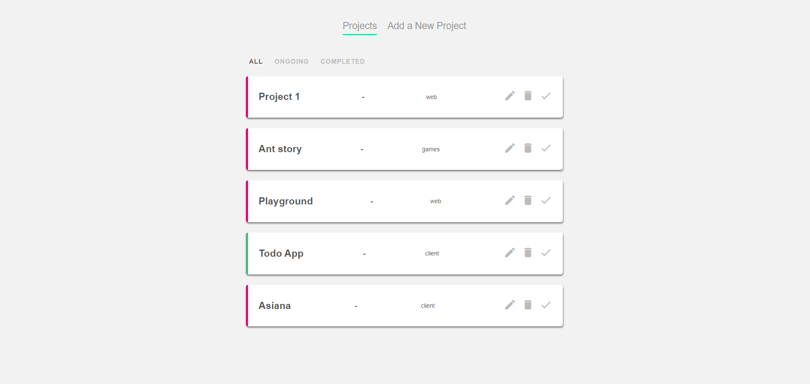

# Project: TODO app

> A simple vue app for project in todo list style.

_Things I have experimenting with_
|used |level of understanding |
|---------|---------|
|router | very good|
|structure of app | extremly good|
|emit event | very good|

---
